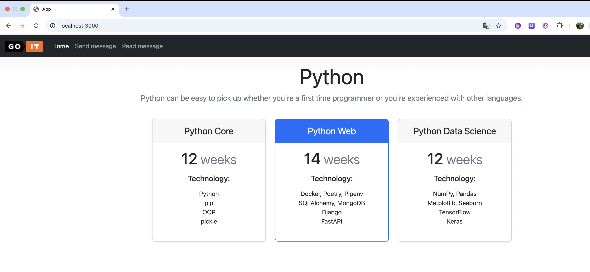
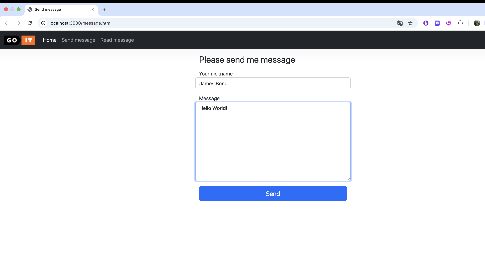
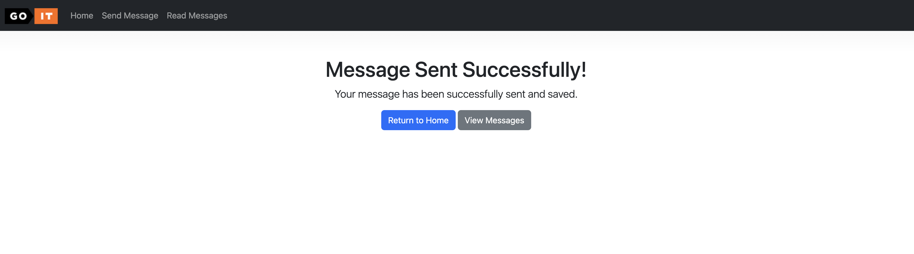
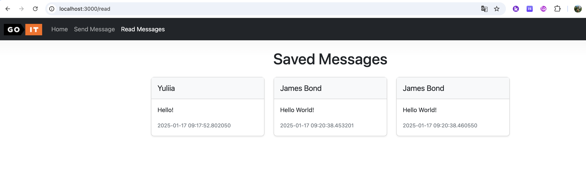
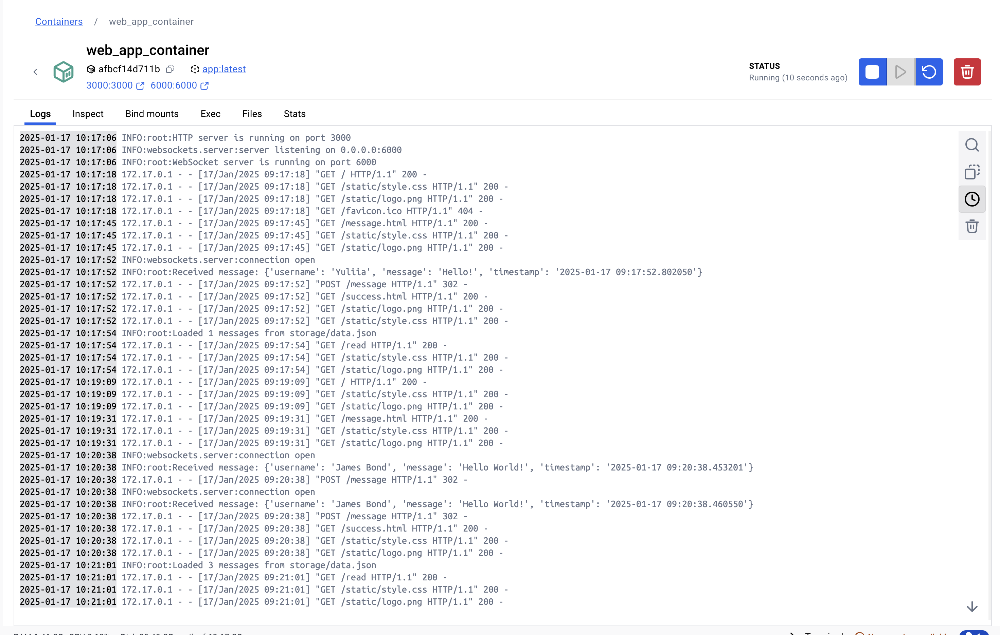

# Тема 3. Домашня робота

Ваша мета реалізувати найпростіший веб-додаток. За основу взяти наступні файли з
цього репозиторію
https://github.com/GoIT-Python-Web/FullStack-Web-Development-hw3.

## Технічний опис завдання

За аналогією з розглянутим прикладом у конспекті, створіть веб-додаток з
маршрутизацією для двох `html` сторінок: `index.html` та `message.html`.

Також:

- Обробіть під час роботи програми статичні ресурси: `style.css`, `logo.png`;
- Організуйте роботу з формою на сторінці `message.html`;
- У разі виникнення помилки `404 Not Found` повертайте сторінку `error.html`
- Ваша програма працює на порту `3000`

При роботі з формою отриманий байт-рядок перетворюємо у словник і зберігаємо
його в json файл `data.json` в директорію `storage`.

Формат запису файлу `data.json` наступний:

```json
{
  "2022-10-29 20:20:58.020261": {
    "username": "krabaton",
    "message": "First message"
  },
  "2022-10-29 20:21:11.812177": {
    "username": "Krabat",
    "message": "Second message"
  }
}
```

Де ключ кожного повідомлення - це час отримання повідомлення: `datetime.now()`.
Тобто кожне нове повідомлення від веб-програми дописується до файлу
`storage/data.json` з часом отримання.

Додайте маршрут `/read` при звертанні до якого буде сформована інформаційна
сторінка. Ця сторінка повинна бути шаблоном Jinja2. Вона повинна виводити всі
збереженні сповіщення з файлу `data.json`.

## Додаткове завдання

Це додаткове завдання і його можна не виконувати для здачі цього домашнього
завдання.

1. Створіть Dockerfile та запустіть ваш додаток як Docker-контейнер.
2. За допомогою механізму voluemes, зберігайте дані з storage/data.json не
   всередині контейнера.

## Загальні вимоги до виконання домашнього завдання

> [!NOTE]
>
> Вимоги до виконання домашнього завдання є обов’язковою умовою оцінювання
> домашнього завдання ментором. Якщо якусь з вимог не виконано, ДЗ
> відправляється ментором на доопрацювання без оцінювання. Якщо вам «тільки
> уточнити»😉 або ви «застопорилися» на якомусь з етапів виконання — звертайтеся
> до ментора у Slack).

### Основні вимоги:

1. **Маршрутизація.**

- Створені дві HTML-сторінки: `index.html` та `message.html`.
- Присутня обробка статичних ресурсів (файл `style.css`, зображення `logo.png`).
- Веб-додаток працює на порту 3000.

2. **Обробка форм.**

Форма на сторінці `message.html` працює коректно, відправляє дані (username та
message). Дані з форми перетворюються на словник та записуються у файл
`data.json` у форматі:

```json
{
  "%timestamp%": {
    "username": "example",
    "message": "example message"
  }
}
```

3. При зверненні до маршруту `/read` повертається шаблонна сторінка Jinja2, яка
   виводить всі збережені повідомлення з файлу `data.json`.

4. При виникненні помилки 404 повертається сторінка `error.html`.

5. Повідомлення зберігаються у файл `storage/data.json` у форматі JSON, де
   ключ - це час отримання повідомлення.

### Додаткові вимоги (опціональні, не обов’язкові для виконання):

- Створений `Dockerfile`, який дозволяє запустити додаток як Docker-контейнер.

- Застосовано механізм volumes для збереження файлу `data.json` за межами
  контейнера.

## Підготовка та завантаження домашнього завдання

1. Створіть публічний репозиторій goit-pythonweb-hw-03.
2. Виконайте завдання та відправте його у свій репозиторій.
3. Завантажте робочі файли на свій комп’ютер та прикріпіть їх у LMS у форматі
   zip.
4. Назва архіву повинна бути у форматі ДЗ3_ПІБ.
5. Прикріпіть посилання на репозиторій goit-pythonweb-hw-03 та відправте на
   перевірку.

## Формат оцінювання

- Оцiнка вiд 0-100

Реалізація основних вимог оцінюється у 100 балів:

- Маршрутизація оцінюється у 30 балів (створення HTML-сторінок — 10 б., обробка
  статичних ресурсів — 10 б., робота на порту 3000 — 10 б.).
- Обробка форм оцінюється у 30 балів (коректна робота — 15 б., перетворення та
  запис даних — 15 б.).
- Повернення шаблонної сторінки Jinja2 оцінюється у 15 балів.
- Повернення сторінки `error.html` оцінюється у 10 балів.
- Збереження повідомлень у файл `storage/data.json` оцінюється у 15 балів.

Реалізація додаткових завдань оцінюється у додаткові 20 балів, але сумарна
оцінка не може бути більшою 100:

- Створення `Dockerfile` оцінюється у 10 балів.
- Застосування механізму volumes оцінюється у 10 балів.

> [!CAUTION]
>
> Якщо є помилки або недоліки виконання, кількість балів зменшується пропорційно
> до наявних помилок на розсуд ментора.
>
> УВАГА!! У вас є можливість обрати підхід до виконання та можливого
> доопрацювання домашнього завдання:
>
> - задовольнитися першою отриманою оцінкою (звісно ж, якщо вона вище прохідного
>   бала),
>
> - намагатися отримати вищий бал шляхом можливого послідуючого доопрацювання
>   роботи у відповідності з фідбеком ментора.
>
> Обраний підхід до виконання ДЗ необхідно зазначити у полі для здачі до
> прикріпленого завдання. За відсутності коментаря ментор дотримується першого
> підходу й виставляє отриману оцінку.

> [!IMPORTANT]
>
> Відправляйте ДЗ на перевірку, коли зроблено все можливе, оскільки кількість
> спроб здачі завдання впливає на отриманий бал! За кожну наступну спробу після
> другої (тобто з третьої) максимально можлива кількість балів зменшується на 5.
> Таким чином: 1 спроба: максимальна кількість балів – 100, 2 спроба:
> максимальна кількість балів – 100, 3 спроба: максимальна кількість балів – 95,
> 4 спроба: максимальна кількість балів – 90, 5 спроба: максимальна кількість
> балів – 85, тощо Критерії оцінювання робіт у магістратурі GoIt Neoversity

## Формат здачі

- Прикріплені файли репозиторію у форматі zip з назвою ДЗ3_ПІБ.
- Посилання на репозиторій.

> [!WARNING]
>
> 🚨 ВАЖЛИВО Перегляньте Інструкцію щодо завантаження робочого файлу з
> репозиторію на Github

### Результати виконаного завдання:










